# Voland — Design Document

A Nintendo Switch emulator targeting the web as a primary platform, with native apps on iOS, Android, macOS, tvOS, visionOS, Windows, Linux, and Xbox.

---

## Table of Contents

1. [Project Overview](#1-project-overview)
   - 1.5 [Non-Goals](#15-non-goals)
   - 1.6 [Legal Scope Boundaries](#16-legal-scope-boundaries)
2. [Repository Structure](#2-repository-structure)
3. [Core Principles](#3-core-principles)
4. [Threading Model](#4-threading-model)
5. [CPU Backend Interface](#5-cpu-backend-interface)
6. [No-Op Backend](#6-no-op-backend)
7. [Ballistic Integration Plan](#7-ballistic-integration-plan)
   - 7b. [Ballistic WASM Backend Architecture](#7b-ballistic-wasm-backend-architecture)
8. [HLE Service Layer](#8-hle-service-layer)
9. [GPU Architecture](#9-gpu-architecture)
10. [Audio Pipeline](#10-audio-pipeline)
11. [Storage Architecture](#11-storage-architecture)
12. [Web Platform Layer](#12-web-platform-layer)
13. [Native Platform Layers](#13-native-platform-layers)
14. [Input Handling](#14-input-handling)
15. [Mod System](#15-mod-system)
16. [Local Multiplayer](#16-local-multiplayer)
17. [Amiibo](#17-amiibo)
18. [Companion App](#18-companion-app)
19. [Developer Tooling](#19-developer-tooling)
20. [Build System](#20-build-system)
21. [Development Phases](#21-development-phases)
22. [Contributing](#22-contributing)
23. [Reference Implementations](#23-reference-implementations)
24. [Risk Register](#24-risk-register)

---

## 1. Project Overview

A Nintendo Switch 1 (and eventually Switch 2) emulator targeting all major platforms from a single C core. The primary innovation is a WASM-first architecture enabling browser-based emulation with zero installation friction. Secondary targets are iOS, Android, desktop, and living room platforms.

### Design goals in priority order

1. **Correct**, games run as they do on hardware
2. **Portable**, one C core, all platforms
3. **Web-first**, browser is a first-class target, not an afterthought
4. **Fast**, playable frame rates on consumer hardware
5. **Open**, no proprietary dependencies in core

### What makes this different from existing emulators

- WASM as a primary JIT emission target, not a port
- WebGPU renderer built from the start, not retrofitted
- CPU backend is an abstract vtable, the recompiler (Ballistic) slots in when ready, dynarmic or interpreter used until then
- All platform layers are thin, the C core does the work, platforms provide surfaces
- Web version is not a second-class citizen, it is the primary distribution mechanism

### Recompiler dependency

The primary recompiler target is **Ballistic** (github.com/pound-emu/ballistic), a C rewrite of dynarmic currently in early development. The architecture is explicitly designed so that Ballistic is a replaceable component behind an abstract interface. The project is fully buildable and testable with:

- **No-op backend** (default), for building and testing everything except actual game execution
- **Interpreter backend**, slow but correct, unblocks homebrew and HLE testing
- **Dynarmic backend**, interim desktop recompiler until Ballistic matures
- **Ballistic backend**, primary target, wired in when instruction coverage is sufficient

**Nothing in the project except playable performance depends on Ballistic being complete.**

---

## 1.5 Non-Goals

To keep the project focused, several things are explicitly NOT goals. Contributors proposing features that fall under these will be redirected here.

- **Faster than Ryujinx on desktop.** Mature native emulators (Ryujinx, Suyu, Citron) are ahead on raw performance and compatibility on desktop and will stay ahead. Voland's contribution is *deployment surface* (browser + every native platform), not speed. The desktop builds exist to support development and reach users on platforms where browser deployment isn't appropriate, not to compete on benchmark numbers.

- **Day-one Switch 2 support.** Switch 2 is a future target, not a current one. The console is closed; meaningful Switch 2 work waits on the broader scene. Voland's architecture extends to Switch 2 (memory64, sparse VMM), but the project is not racing to be first.

- **Hosting games or distributing Nintendo IP.** Voland never includes, distributes, or operates infrastructure that touches Nintendo's copyrighted material. Users provide their own keys, their own decrypted game files, from hardware they own. See §1.6 for the legal scope this implies.

- **Wii U, GameCube, or other console emulation.** The architecture is Switch-specific. The CPU backend abstraction would technically allow other ARM-based or even non-ARM targets, but doing so dilutes the project's focus and inflates its scope beyond what a small team can sustain.

- **Server-side emulation or cloud streaming.** Everything runs client-side in the browser or natively on the user's device. Voland operates no game-execution servers.

- **Replacing reference implementations.** Ryubing, dynarmic, yuzu (archived), Emscripten Relooper are studied as references and reimplemented under Voland's architecture. We do not fork them, do not maintain compatibility with them, and do not aim to be a drop-in replacement for any of them.

- **Aggregated cache or community-shared compiled artifacts.** Per the Yuzu shader cache shutdown precedent (March 2024 settlement), Voland does not operate any server that distributes cache derived from Nintendo binaries. Per-user caches stay local; manual export is supported for friend-to-friend sharing.

---

## 1.6 Legal Scope Boundaries

Voland's design avoids functionality that has been the subject of recent emulator-targeted legal action. These boundaries are non-negotiable scope decisions, not optimizations to revisit later.

### No decryption of Nintendo-encrypted content

Voland accepts only **pre-decrypted** game files. Users decrypt NSP/XCI files using separate tools (hactool, nxdumptool, or equivalent) before providing files to Voland. The Voland codebase does not contain NCA decryption logic, does not consume Nintendo's prod.keys for decryption, and does not implement Nintendo's key-derivation scheme.

**Why:** Section 1201 of the DMCA prohibits software that circumvents technological measures controlling access to copyrighted works, regardless of whether the user provides their own keys, regardless of the project being non-commercial, regardless of the user owning the games. This is the legal theory that:

- Killed Yuzu (March 2024 settlement)
- Killed Citra (same case, both Tropic Haze projects)
- Triggered Suyu's DMCA pause and pre-decrypted-ROM transition (April 2026)

Voland adopts the pre-decrypted-input posture from the start to avoid the same fate. The user-experience cost is real (users must learn a separate decryption tool); the alternative is being shut down.

### No distribution of derived caches

Per the Yuzu settlement's shutdown of shader cache distribution, Voland does not operate any server that aggregates compiled or transformed game-derived data. The "Increase performance for others" toggle (described later in this document) operates locally with manual export only — Voland infrastructure never holds user cache data.

### No distribution of Nintendo IP in any form

No keys, no firmware, no game files, no derivatives in the Voland repository or any Voland-operated infrastructure. The emulator is generic ARM64 runtime infrastructure; the user supplies the data. This is the same legal posture as Wine (doesn't decrypt Windows binaries) and QEMU (doesn't decrypt ARM firmware).

### What this looks like to users

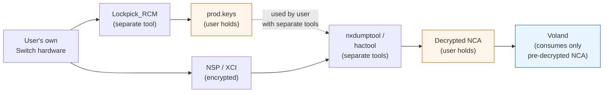

Voland's role is the rightmost box. Everything to the left is the user's responsibility, performed with tools that are not part of Voland.

### What this means for code organization

The loader subsystem (`core/hle/loader/`) accepts already-decrypted NCA files and parses their internal structure (RomFS, ExeFS, npdm). It does **not** contain encryption-handling code. There is no `nca_decrypt.c`, no key-derivation functions, no AES handling for game content, and no NSP/XCI extraction logic that operates on encrypted input.

If a user attempts to load an encrypted NSP or XCI file, Voland reports an error directing them to decrypt using separate tools first.

---

## 2. Repository Structure

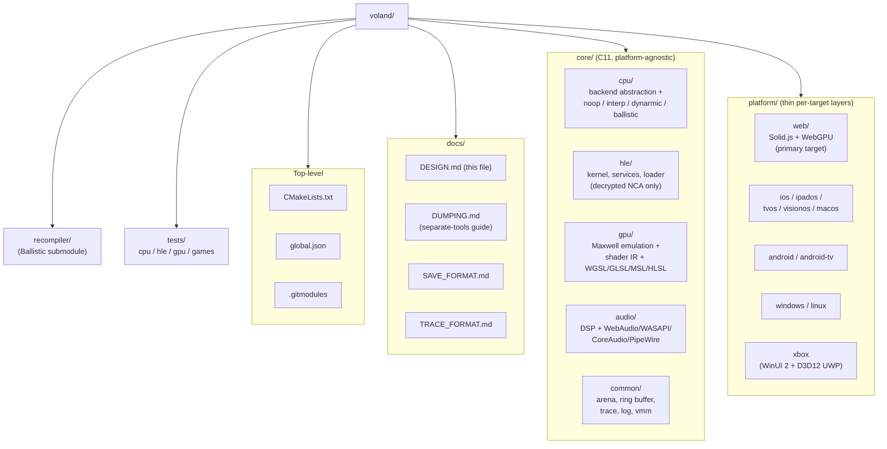

Detailed layout for each subtree:

```
core/
  cpu/
    cpu.h                    # abstract CPU backend interface
    cpu.c                    # backend wiring and emulator loop
    backends/
      noop/                  # default, always builds
      interpreter/           # ARM64 interpreter
      dynarmic/              # C++ wrapper around dynarmic
      ballistic/             # Ballistic integration

  hle/
    hle.h
    hle.c                    # syscall dispatch table
    kernel/
      memory.{h,c}           # heap, virtual memory management
      thread.{h,c}           # thread creation and scheduling
      ipc.{h,c}              # inter-process communication
    services/
      sm/                    # service manager
      fsp/                   # filesystem (fsp-srv, fsp-ldr, fsp-pr)
      audio/                 # IAudioDevice, IAudioRenderer, IAudioIn
      hid/                   # IHidServer, controllers, gyro, NFC
      nfc/                   # amiibo
      network/               # LDN local play, BSD sockets
      nvdrv/                 # NVIDIA driver, GPU command submission
      time/                  # IStaticService, ITimeZoneService
      applet/                # appletOE, appletAE, app lifecycle
      account/               # user accounts
      friends/               # friend list
      ssl/                   # TLS (stub)
    loader/
      ## Voland's loader operates on PRE-DECRYPTED input only.
      ## See §1.6. No NCA decryption code in this tree.
      nca_parse.{h,c}        # parse decrypted NCA structure (RomFS, ExeFS, npdm)
      romfs.{h,c}            # RomFS reader (decrypted input)
      exefs.{h,c}            # ExeFS reader (decrypted input)
      npdm.{h,c}             # process metadata reader (decrypted input)

  gpu/
    gpu.h                    # abstract GPU backend interface
    gpu.c
    engines/
      engine_2d.c
      engine_3d.c            # Kepler/Maxwell
      engine_compute.c
    memory/
      gmmu.{h,c}             # GPU memory management unit
    shader/
      decompiler.{h,c}       # Maxwell shader → IR
      uber_shader.{h,c}      # uber-shader fallback
      backends/
        wgsl.c               # WebGPU
        glsl.c               # Vulkan
        msl.c                # Metal
        hlsl.c               # D3D12
    texture/
      decode.{h,c}           # texture format decoding
      transcode.c            # ASTC → BC7/ETC2 via compute shader

  audio/
    audio.h                  # abstract audio backend interface
    audio.c
    dsp/
      dsp.{h,c}              # DSP emulation
    backends/
      webaudio/              # Web Audio API
      wasapi/                # Windows
      coreaudio/             # Apple platforms
      pipewire/              # Linux

  common/
    arena.{h,c}              # arena allocator, no malloc in hot paths
    ring_buffer.{h,c}        # lock-free ring buffer for audio
    log.{h,c}                # structured logging to trace buffer
    assert.h                 # debug assertions
    vmm.{h,c}                # virtual memory manager (sparse, Switch 2)

platform/web/
  vite.config.ts
  tsconfig.json
  index.html
  manifest.json              # PWA manifest
  bindings/                  # C ↔ WASM ↔ JS bridge
    core.ts                  # typed WASM exports
    protocol.ts              # worker message protocol types
  workers/
    cpu.worker.ts            # CPU emulation loop
    gpu.worker.ts            # WebGPU rendering
    audio.worker.ts          # audio sample pipeline
  shared-workers/
    compiler.shared-worker.ts          # WebAssembly.compile() cache
    save-sync.shared-worker.ts         # serialised OPFS save writes
    compatibility.shared-worker.ts     # game compatibility DB
  sw.ts                      # service worker
  src/
    main.ts                  # boot sequence
    router.ts                # Navigation API routing
    store/                   # Solid.js signals and stores
    components/
      GameLibrary/
      GameCanvas/
      Settings/
      SaveManager/
      ModManager/
      CompatibilityList/
      Overlays/
    styles/

platform/{ios,macos,tvos,visionos}/   # SwiftUI + Metal
platform/{android,android-tv}/        # Jetpack Compose + Vulkan
platform/{windows,linux}/             # Qt + Vulkan/D3D12
platform/xbox/                        # WinUI 2 + D3D12 (UWP, Developer Mode)

recompiler/                           # Ballistic git submodule
  (github.com/pound-emu/ballistic)

tests/
  cpu/                       # ARM instruction correctness tests
  hle/                       # HLE service implementation tests
  gpu/                       # GPU output correctness tests
  games/                     # per-title compatibility regression tests
```

---

## 3. Core Principles

### Language

- **Core:** C11 strictly. No C++ in core except the dynarmic wrapper which requires it.
- **Web platform:** TypeScript strict mode throughout. No `any`. No implicit returns.
- **Native platforms:** Swift (Apple), Kotlin (Android), C++ (Qt desktop).
- **No exceptions in C code.** Use explicit error returns everywhere.
- **No dynamic allocation in hot paths.** Use arena allocators.

### Naming conventions (DAMP, Descriptive and Meaningful Phrases)

```c
// Good, intent is clear without comments
void hle_dispatch_ipc_request(HLE_Context* context,
                              uint64_t     target_session_handle,
                              IPC_Message* message);

// Bad, abbreviated to the point of obscurity
void hle_dipc(HLE_Ctx* c, uint64_t h, IPC_Msg* m);
```

```typescript
// Good
async function loadGameFileFromFilesystemHandle(
  directoryHandle: FileSystemDirectoryHandle,
  titleId: string
): Promise<GameFileLoadResult>

// Bad
async function load(h: FileSystemDirectoryHandle, id: string)
```

### No magic numbers

```c
// Bad
if (error_code == 0xF001) { ... }

// Good
#define HLE_ERROR_SERVICE_NOT_FOUND 0xF001
if (error_code == HLE_ERROR_SERVICE_NOT_FOUND) { ... }
```

### Immutability in TypeScript

Never mutate state passed into a function. Always return new state:

```typescript
// Bad
function addGameToLibrary(library: Game[], game: Game): Game[] {
  library.push(game);
  return library;
}

// Good
function addGameToLibrary(library: Game[], game: Game): Game[] {
  return [...library, game];
}
```

### Error handling

```c
// C, explicit result type, no exceptions
typedef enum Result {
  RESULT_OK              = 0,
  RESULT_OUT_OF_MEMORY   = 1,
  RESULT_INVALID_ARGUMENT= 2,
  RESULT_NOT_FOUND       = 3,
  RESULT_IO_ERROR        = 4,
} Result;

typedef struct {
  Result      code;
  const char* message; // static string, never heap allocated
} Error;

#define OK         ((Error){ .code = RESULT_OK, .message = NULL })
#define ERR(c, m)  ((Error){ .code = (c), .message = (m) })
```

```typescript
// TypeScript, Result type, no thrown exceptions in business logic
type Success<T> = { readonly success: true;  readonly value: T };
type Failure     = { readonly success: false; readonly error: string };
type Result<T>   = Success<T> | Failure;

function ok<T>(value: T): Success<T>   { return { success: true,  value }; }
function err(error: string): Failure   { return { success: false, error }; }
```

---

## 4. Threading Model

### Thread layout

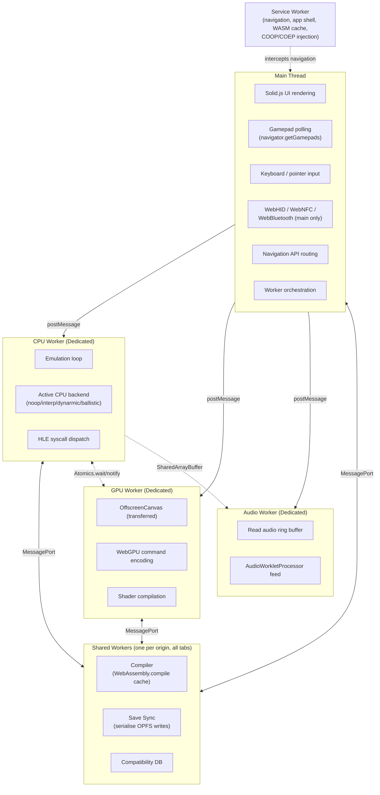

The dashed lines indicate shared-memory synchronization (Atomics + SharedArrayBuffer); solid lines are message-passing (postMessage / MessagePort).

### Shared memory layout

| Buffer | Size | Producers | Consumers | Sync |
|---|---|---|---|---|
| Guest RAM | 4GB (memory64) | CPU Worker | CPU Worker, GPU Worker (framebuffer read) | Frame Sync below |
| Frame Sync | 4 bytes (Int32) | CPU Worker writes 1 on frame ready | GPU Worker waits on 0→1 | Atomics.store + Atomics.notify |
| Audio Ring | configurable | CPU Worker writes samples | Audio Worker reads | Atomics.notify on write |
| Trace Buffer | 64KB+ | All workers (atomic write index) | UI thread (timeline), Chrome extension (out-of-process) | Atomic write index |
| Breakpoint Buffer | sparse, page-indexed | Chrome extension or in-page debugger | CPU Worker (checks on block entry) | Atomic flag bits |

### Frame synchronization flow

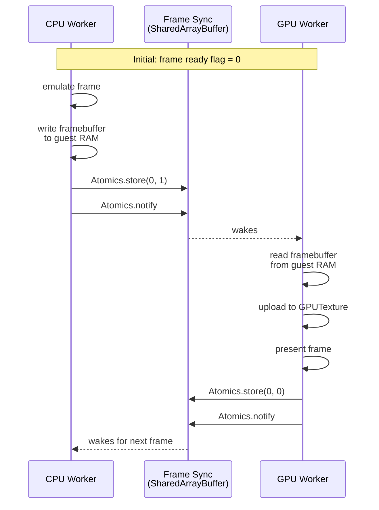

### Data flow through workers

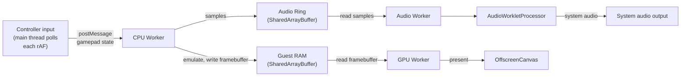

### JIT compilation pipeline

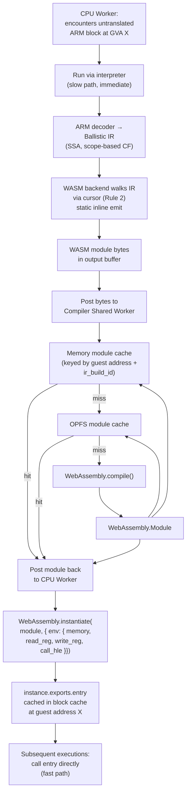

The cache key includes `ir_build_id` so that IR-layer compaction passes (which can change SSA index assignments) correctly invalidate previously-compiled modules. See §11 (Storage Architecture).

---

## 5. CPU Backend Interface

This interface is the most important abstraction in the project. Every backend implements it exactly. Nothing outside the backend code knows or cares which backend is active.

### Interface relationships

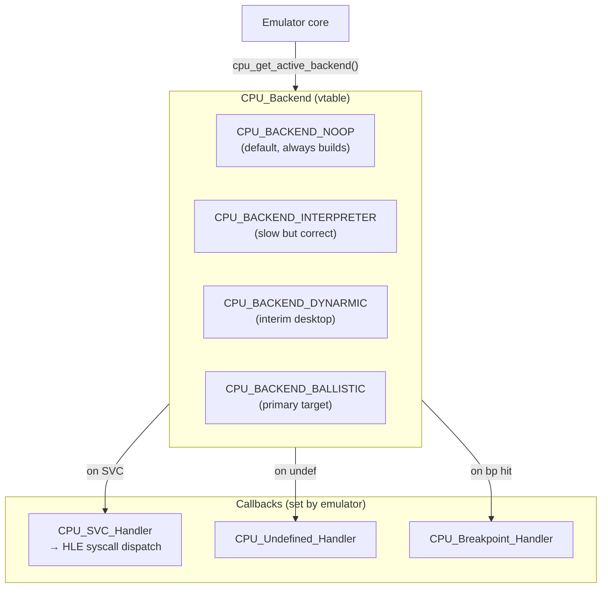

### Header

```c
// core/cpu/cpu.h
#pragma once
#include <stdint.h>
#include <stdbool.h>
#include <stddef.h>

typedef struct CPU_State   CPU_State;
typedef struct CPU_Backend CPU_Backend;
typedef struct Emulator    Emulator;

//  Callbacks set by the emulator, called by the backend

// Called when the guest executes SVC (supervisor call / syscall)
// swi: the immediate value in the SVC instruction (syscall ID is in X8)
typedef void (*CPU_SVC_Handler)(CPU_State* state, uint32_t swi, void* userdata);

// Called when the guest executes an undefined/unallocated instruction
typedef void (*CPU_Undefined_Handler)(CPU_State* state, uint32_t instruction, void* userdata);

// Called when execution reaches a breakpoint address
typedef void (*CPU_Breakpoint_Handler)(CPU_State* state, uint64_t address, void* userdata);

//  The backend interface

typedef struct CPU_Backend {
  // Lifecycle
  CPU_State* (*create)(
    void*    guest_ram,       // pointer to SharedArrayBuffer contents (WASM) or mmap'd region
    uint64_t ram_size,        // size in bytes
    void*    userdata         // passed to all callbacks
  );
  void (*destroy)(CPU_State* state);

  // Execution
  void (*run)(CPU_State* state, uint64_t entry_point);
  void (*step)(CPU_State* state);
  void (*run_until)(CPU_State* state, uint64_t address);

  // General purpose registers X0-X30 (index 0-30)
  uint64_t (*get_reg)(CPU_State* state, uint8_t reg_index);
  void     (*set_reg)(CPU_State* state, uint8_t reg_index, uint64_t value);

  // Special registers
  uint64_t (*get_pc)(CPU_State* state);
  void     (*set_pc)(CPU_State* state, uint64_t value);
  uint64_t (*get_sp)(CPU_State* state);
  void     (*set_sp)(CPU_State* state, uint64_t value);
  uint32_t (*get_pstate)(CPU_State* state);   // NZCV flags
  void     (*set_pstate)(CPU_State* state, uint32_t value);

  // System registers (MRS/MSR)
  uint64_t (*get_sys_reg)(CPU_State* state, uint32_t encoded_reg);
  void     (*set_sys_reg)(CPU_State* state, uint32_t encoded_reg, uint64_t value);

  // Execution control
  void (*halt)(CPU_State* state);
  bool (*is_halted)(CPU_State* state);

  // Code cache management (call after writing to guest RAM, e.g. self-modifying code)
  void (*invalidate_cache)(CPU_State* state, uint64_t guest_address, uint64_t size_bytes);
  void (*clear_cache)(CPU_State* state);

  // Callback registration
  void (*set_svc_handler)(CPU_State* state, CPU_SVC_Handler handler);
  void (*set_undefined_handler)(CPU_State* state, CPU_Undefined_Handler handler);
  void (*set_breakpoint_handler)(CPU_State* state, CPU_Breakpoint_Handler handler);

  // Backend metadata
  const char* name;          // "noop", "interpreter", "dynarmic", "ballistic"
  const char* version;       // semver string
  bool        supports_jit;  // false for noop and interpreter
  bool        supports_wasm; // true only for ballistic WASM backend
} CPU_Backend;

//  Available backends (defined in their respective .c files)

extern const CPU_Backend CPU_BACKEND_NOOP;
extern const CPU_Backend CPU_BACKEND_INTERPRETER;
extern const CPU_Backend CPU_BACKEND_DYNARMIC;   // only if built with -DCPU_BACKEND=dynarmic
extern const CPU_Backend CPU_BACKEND_BALLISTIC;  // only if built with -DCPU_BACKEND=ballistic

//  Backend selection

const CPU_Backend* cpu_get_active_backend(void);
```

### Register index reference

```c
// ARM64 register conventions
// X0-X7:   function arguments and return values
// X8:      syscall number (for SVC)
// X9-X15:  caller-saved temporaries
// X16-X17: intra-procedure-call scratch (IP0, IP1)
// X18:     platform register (reserved)
// X19-X28: callee-saved registers
// X29:     frame pointer (FP)
// X30:     link register (LR), return address for BL/BLR
// XZR:     zero register (reads as 0, writes discarded), index 31 by convention

#define CPU_REG_X0   0
#define CPU_REG_X8   8   // syscall number
#define CPU_REG_X29  29  // frame pointer
#define CPU_REG_X30  30  // link register
#define CPU_REG_XZR  31  // zero register
```

---

## 6. No-Op Backend

The no-op backend is the default. It builds on all platforms with zero dependencies. It correctly maintains register state so HLE services can read and write registers. It calls the SVC handler so HLE syscall dispatch works. It does not execute any ARM instructions.

**Every subsystem except actual game execution can be built and tested with the no-op backend.**

### Why this matters

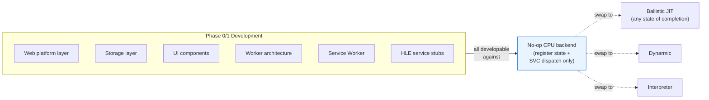

The entire frontend, storage layer, worker architecture, Service Worker, and HLE scaffolding can be built, tested, and reviewed without any working CPU emulation. This decouples Voland's development from Ballistic's development entirely.

### Implementation

```c
// core/cpu/backends/noop/noop.c

#include "cpu/cpu.h"
#include "common/log.h"
#include <stdlib.h>
#include <string.h>

typedef struct {
  uint64_t         general_regs[31]; // X0-X30
  uint64_t         pc;
  uint64_t         sp;
  uint32_t         pstate;           // NZCV flags
  bool             halted;
  void*            guest_ram;
  uint64_t         ram_size;
  void*            userdata;
  CPU_SVC_Handler        svc_handler;
  CPU_Undefined_Handler  undefined_handler;
  CPU_Breakpoint_Handler breakpoint_handler;
} NoopState;

static CPU_State* noop_create(void* guest_ram, uint64_t ram_size, void* userdata) {
  NoopState* state = calloc(1, sizeof(NoopState));
  if (!state) return NULL;
  state->guest_ram = guest_ram;
  state->ram_size  = ram_size;
  state->userdata  = userdata;
  state->halted    = false;
  return (CPU_State*)state;
}

static void noop_destroy(CPU_State* state) {
  free(state);
}

static void noop_run(CPU_State* state, uint64_t entry_point) {
  NoopState* s = (NoopState*)state;
  s->pc = entry_point;
  log_debug("[NOOP] run() called at guest PC 0x%016llX, no instructions executed", entry_point);
  // No-op: HLE services still fire because the emulator calls them
  // directly through the SVC handler, not through instruction execution
}

static void noop_step(CPU_State* state)                          { /* no-op */ }
static void noop_run_until(CPU_State* state, uint64_t address)   { /* no-op */ }

static uint64_t noop_get_reg(CPU_State* state, uint8_t index) {
  if (index >= 31) return 0; // XZR
  return ((NoopState*)state)->general_regs[index];
}

static void noop_set_reg(CPU_State* state, uint8_t index, uint64_t value) {
  if (index >= 31) return; // XZR writes are discarded
  ((NoopState*)state)->general_regs[index] = value;
}

static uint64_t noop_get_pc(CPU_State* state)                    { return ((NoopState*)state)->pc; }
static void     noop_set_pc(CPU_State* state, uint64_t v)        { ((NoopState*)state)->pc = v; }
static uint64_t noop_get_sp(CPU_State* state)                    { return ((NoopState*)state)->sp; }
static void     noop_set_sp(CPU_State* state, uint64_t v)        { ((NoopState*)state)->sp = v; }
static uint32_t noop_get_pstate(CPU_State* state)                { return ((NoopState*)state)->pstate; }
static void     noop_set_pstate(CPU_State* state, uint32_t v)    { ((NoopState*)state)->pstate = v; }

static uint64_t noop_get_sys_reg(CPU_State* state, uint32_t reg) { return 0; }
static void     noop_set_sys_reg(CPU_State* state, uint32_t reg, uint64_t value) { }

static void noop_halt(CPU_State* state)      { ((NoopState*)state)->halted = true; }
static bool noop_is_halted(CPU_State* state) { return ((NoopState*)state)->halted; }

static void noop_invalidate_cache(CPU_State* state, uint64_t addr, uint64_t size) { }
static void noop_clear_cache(CPU_State* state) { }

static void noop_set_svc_handler(CPU_State* state, CPU_SVC_Handler h) {
  ((NoopState*)state)->svc_handler = h;
}
static void noop_set_undefined_handler(CPU_State* state, CPU_Undefined_Handler h) {
  ((NoopState*)state)->undefined_handler = h;
}
static void noop_set_breakpoint_handler(CPU_State* state, CPU_Breakpoint_Handler h) {
  ((NoopState*)state)->breakpoint_handler = h;
}

const CPU_Backend CPU_BACKEND_NOOP = {
  .create                 = noop_create,
  .destroy                = noop_destroy,
  .run                    = noop_run,
  .step                   = noop_step,
  .run_until              = noop_run_until,
  .get_reg                = noop_get_reg,
  .set_reg                = noop_set_reg,
  .get_pc                 = noop_get_pc,
  .set_pc                 = noop_set_pc,
  .get_sp                 = noop_get_sp,
  .set_sp                 = noop_set_sp,
  .get_pstate             = noop_get_pstate,
  .set_pstate             = noop_set_pstate,
  .get_sys_reg            = noop_get_sys_reg,
  .set_sys_reg            = noop_set_sys_reg,
  .halt                   = noop_halt,
  .is_halted              = noop_is_halted,
  .invalidate_cache       = noop_invalidate_cache,
  .clear_cache            = noop_clear_cache,
  .set_svc_handler        = noop_set_svc_handler,
  .set_undefined_handler  = noop_set_undefined_handler,
  .set_breakpoint_handler = noop_set_breakpoint_handler,
  .name                   = "noop",
  .version                = "1.0.0",
  .supports_jit           = false,
  .supports_wasm          = false,
};
```

---

## 7. Ballistic Integration Plan

### What Ballistic is

Ballistic ([github.com/pound-emu/ballistic](https://github.com/pound-emu/ballistic)) is a C rewrite of the dynarmic ARM recompiler targeting:

- JIT state struct packed within a single CPU cache line (≤64 bytes)
- Dense array + index linked lists replacing pointer-chasing intrusive lists
- Lightweight IR with minimal per-instruction memory footprint
- Peephole optimizer pass before code emission
- Correct XMM/SIMD register spilling
- Base+index addressing throughout (avoids 8-byte pointer loads)
- No virtual dispatch (written in C, compile-time backend selection)

**Current status (April 2026):** Working barebones x86 backend exists in `src/backend/x86/` (assembler + sliding-window peephole + Tier 1 compiler with greedy register allocator). WASM backend in design.

### IR requirements — status

| Requirement | Status | Notes |
|---|---|---|
| CFG preserved to backend | ✓ Confirmed | Scope-based IR, no jumps |
| SSA value numbering | ✓ Confirmed | Strict SSA, implicit indexing |
| Backend abstraction | Resolved differently | Compile-time via static inline headers + per-backend compiler structs |

The backend interface question resolved differently than originally designed. GloriousTacoo's D-cache constraint (PROGRAMMING_RULES.md) makes function-pointer dispatch in the translation loop unacceptable. The compile-time approach satisfies both the performance constraint and the multi-backend requirement: each backend lives in its own subdirectory with its own compiler struct, selected at compile time via CMake option.

### Backend compilation flow

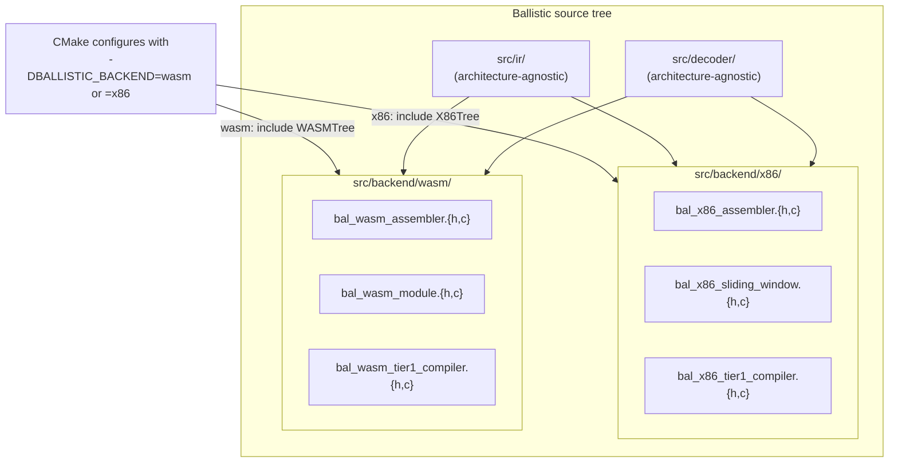

### Voland's CPU backend matrix

The interim path Voland's DESIGN.md previously described (interpreter → dynarmic → ballistic) can now skip dynarmic entirely. Once Ballistic's x86 backend reaches sufficient instruction coverage, it replaces dynarmic as the desktop JIT path, removing Voland's dependency on dynarmic's archived codebase (which requires GCC 14 patches to build).

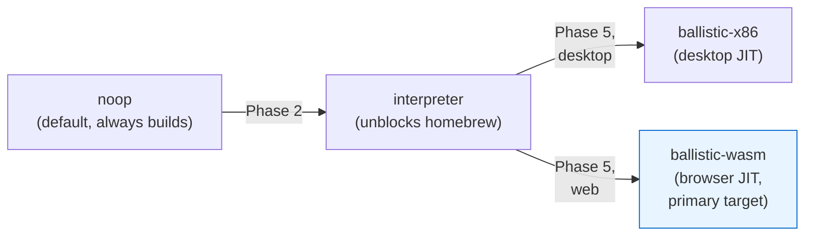

### Executable memory abstraction per platform

```c
// Native (Linux/macOS/Android)
void* native_alloc_executable(void* ctx, size_t size) {
  return mmap(NULL, size, PROT_READ | PROT_WRITE,
              MAP_PRIVATE | MAP_ANONYMOUS, -1, 0);
}
void native_commit_executable(void* ctx, void* mem, size_t size) {
  mprotect(mem, size, PROT_READ | PROT_EXEC);
}

// UWP / Xbox (W^X compliant)
void* uwp_alloc_executable(void* ctx, size_t size) {
  return VirtualAllocFromApp(NULL, size, MEM_COMMIT, PAGE_READWRITE);
}
void uwp_commit_executable(void* ctx, void* mem, size_t size) {
  ULONG old_protection;
  VirtualProtectFromApp(mem, size, PAGE_EXECUTE_READ, &old_protection);
}

// WASM, no executable memory; emit bytecode instead
void* wasm_alloc_executable(void* ctx, size_t size) {
  return malloc(size); // bytecode accumulation buffer
}
void wasm_commit_executable(void* ctx, void* mem, size_t size) {
  // Ship bytecode to JS via Emscripten callback
  // JS calls WebAssembly.compile(new Uint8Array(mem, size))
  wasm_schedule_compile(ctx, mem, size);
}
```

### NEON ↔ WASM SIMD mapping

ARM NEON v8-v31 registers (128-bit) map directly to WASM v128. This must be enabled in the CMake build:

```cmake
# Required for WASM SIMD; without this performance drops ~4x for vertex processing
if(EMSCRIPTEN)
  target_compile_options(switch_core PRIVATE -msimd128)
endif()
```

Key mappings:

```
NEON vadd.i32  →  i32x4.add
NEON vmul.f32  →  f32x4.mul
NEON vld1.32   →  v128.load
NEON vst1.32   →  v128.store
NEON vceq.i32  →  i32x4.eq
NEON vshl.i32  →  i32x4.shl
```

---

## 7b. Ballistic WASM Backend Architecture

The WASM backend mirrors the x86 backend's three-layer structure visible in `src/backend/x86/`. See the Ballistic repo's `docs/WASM_BACKEND_DESIGN_DOC.md` for the full design.

### Three-layer architecture

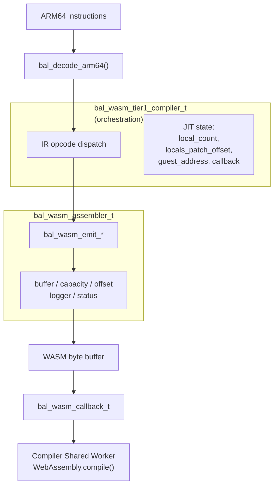

### WASM module structure per compiled block

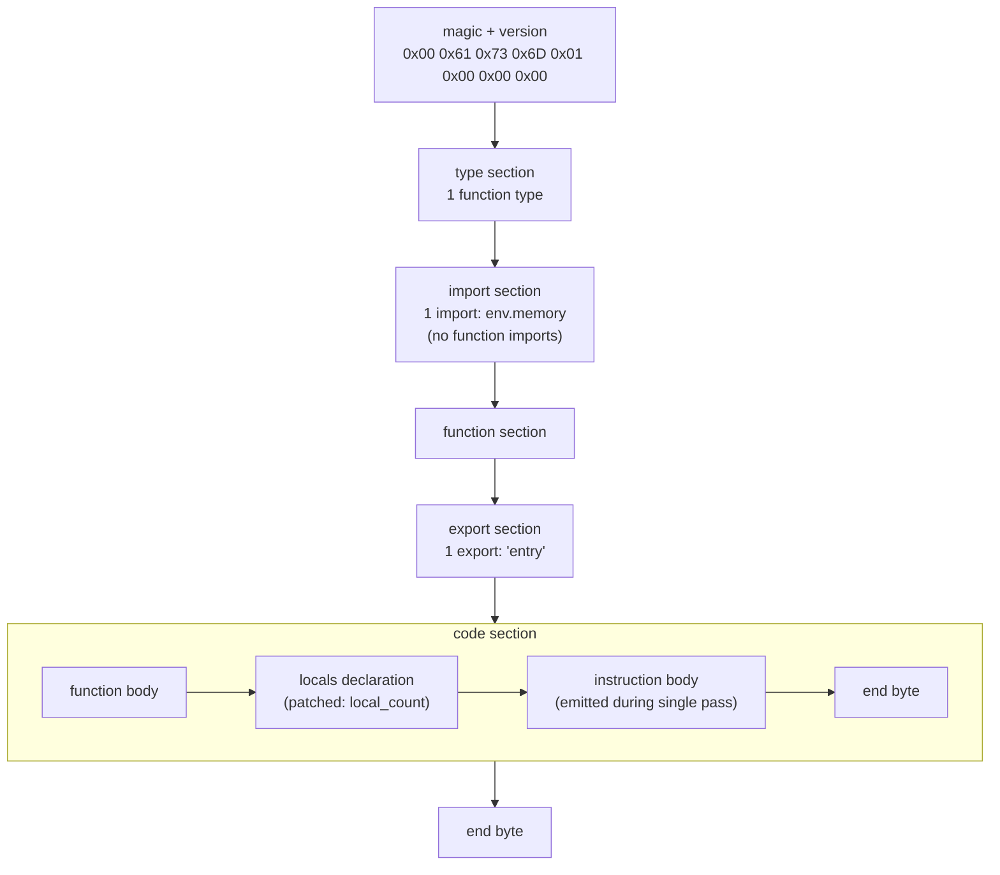

The "no imports" rule applies to **function** imports only — the linear memory import is required to share state with the host and is the single permitted import. The register file lives in linear memory at a known offset (chosen larger than any reachable guest address).

### IR → WASM opcode mapping (current Tier 1 scope)

| Ballistic IR | WASM emission |
|---|---|
| `OPCODE_ADD` (i32) | `local.get src1`, `local.get src2`, `i32.add`, `local.set dst` |
| `OPCODE_ADD` (i64) | `local.get src1`, `local.get src2`, `i64.add`, `local.set dst` |
| `OPCODE_LOAD` | `local.get addr`, `iN.load align=0 offset=0` |
| `OPCODE_STORE` | `local.get addr`, `local.get src`, `iN.store align=0 offset=0` |
| `OPCODE_CONST` | `iN.const`, write to register-file slot |
| `OPCODE_RETURN` | (depends on function signature decision; see WASM_BACKEND_DESIGN_DOC.md) |
| `OPCODE_NOP` | (skip entirely) |

Width is semantic. `bal_wasm_emit_iN_*` exists in both 32-bit and 64-bit variants for every value-producing operation; the compiler emits the variant matching the SSA value's width per `ssa_bit_widths[]`. Width-conversion ops (`i64.extend_i32_u`, `i32.wrap_i64`) handle ARM's W↔X register transitions.

### Future: scope-based control flow

When OPCODE_IF, OPCODE_LOOP, OPCODE_BREAK, OPCODE_CONTINUE, OPCODE_MERGE, and OPCODE_YIELD ship in the IR layer, Ballistic's scope-based control flow maps almost 1:1 to WASM block/loop/if without requiring the Relooper algorithm:

| IR | WASM |
|---|---|
| OPCODE_IF | `if (void)` + depth push |
| OPCODE_LOOP | `loop (void)` + depth push |
| OPCODE_BREAK | `br depth_to_enclosing_block` |
| OPCODE_CONTINUE | `br depth_to_loop_header` |
| OPCODE_MERGE | `end` + `local.set` merged-SSA local |

The emission loop maintains a parallel scope stack alongside Ballistic's `block_scope_stack[]` to track WASM block nesting depth.

### The platform callback

`wasm_module_finalise()` hands the completed bytes to a platform-provided callback. The backend doesn't know or care what happens to the bytes:

```c
typedef void (*wasm_compile_callback_t)(
    uint64_t       guest_address,
    const uint8_t* wasm_bytes,
    size_t         byte_count,
    void*          userdata
);
```

| Platform | What the callback does |
|---|---|
| Web | Posts bytes to Compiler Shared Worker → `WebAssembly.compile()` |
| Desktop (testing) | Passes to Wasmtime or stub |
| Xbox | Passes to UWP WASM runtime |

---

## 8. HLE Service Layer

### Overview

HLE (High Level Emulation) intercepts Switch OS syscalls and implements them directly in the emulator host rather than running Switch OS code. This is how all Switch emulators operate.

### Syscall dispatch flow

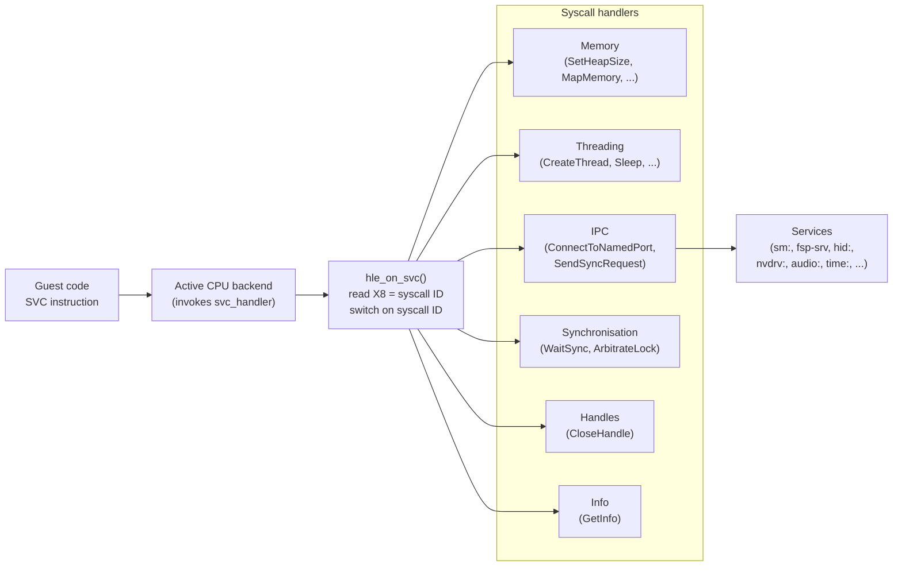

### Implementation

```c
// core/hle/hle.c

void hle_on_svc(CPU_State* cpu_state, uint32_t swi, void* userdata) {
  HLE_Context* context = (HLE_Context*)userdata;

  // Syscall ID is always in X8
  uint64_t syscall_id = context->cpu_backend->get_reg(cpu_state, CPU_REG_X8);

  switch (syscall_id) {
    // Memory
    case 0x01: hle_svc_set_heap_size(context, cpu_state);           break;
    case 0x02: hle_svc_set_memory_permission(context, cpu_state);   break;
    case 0x03: hle_svc_set_memory_attribute(context, cpu_state);    break;
    case 0x04: hle_svc_map_memory(context, cpu_state);              break;
    case 0x05: hle_svc_unmap_memory(context, cpu_state);            break;
    case 0x06: hle_svc_query_memory(context, cpu_state);            break;

    // Threading
    case 0x08: hle_svc_create_thread(context, cpu_state);           break;
    case 0x09: hle_svc_start_thread(context, cpu_state);            break;
    case 0x0A: hle_svc_exit_thread(context, cpu_state);             break;
    case 0x0B: hle_svc_sleep_thread(context, cpu_state);            break;
    case 0x0C: hle_svc_get_thread_priority(context, cpu_state);     break;

    // IPC
    case 0x1F: hle_svc_connect_to_named_port(context, cpu_state);   break;
    case 0x21: hle_svc_send_sync_request(context, cpu_state);       break;
    case 0x22: hle_svc_send_sync_request_with_user_buffer(context, cpu_state); break;

    // Synchronisation
    case 0x18: hle_svc_wait_synchronization(context, cpu_state);    break;
    case 0x19: hle_svc_cancel_synchronization(context, cpu_state);  break;
    case 0x1A: hle_svc_arbitrate_lock(context, cpu_state);          break;
    case 0x1B: hle_svc_arbitrate_unlock(context, cpu_state);        break;

    // Handles
    case 0x26: hle_svc_close_handle(context, cpu_state);            break;

    // Info
    case 0x29: hle_svc_get_info(context, cpu_state);                break;

    default:
      log_warn("[HLE] Unimplemented SVC 0x%02llX at PC 0x%016llX",
               syscall_id,
               context->cpu_backend->get_pc(cpu_state));
      // Set X0 to RESULT_NOT_IMPLEMENTED, game may handle this gracefully
      context->cpu_backend->set_reg(cpu_state, 0, 0xF601);
      break;
  }
}
```

### HLE result type

```c
// core/hle/hle.h

#define HLE_RESULT_SUCCESS              0x00000000
#define HLE_RESULT_NOT_IMPLEMENTED      0xF601
#define HLE_RESULT_INVALID_HANDLE       0xE401
#define HLE_RESULT_INVALID_POINTER      0xCC01
#define HLE_RESULT_OUT_OF_MEMORY        0x1A01
#define HLE_RESULT_NOT_FOUND            0xE002
#define HLE_RESULT_ALREADY_EXISTS       0xFA02

typedef struct {
  uint32_t    error_code;
  const char* result_name;
  bool        was_successful;
} HLE_ServiceResult;

#define HLE_SUCCESS \
  ((HLE_ServiceResult){ .error_code = HLE_RESULT_SUCCESS, \
                        .result_name = "SUCCESS", \
                        .was_successful = true })

#define HLE_FAILURE(code, name) \
  ((HLE_ServiceResult){ .error_code = (code), \
                        .result_name = (name), \
                        .was_successful = false })
```

### Services implementation priority

Games will not boot past the first frame without these, in order:

1. **`sm:`** (service manager) — all other services connect through this
2. **Memory SVCs** — SetHeapSize, QueryMemory, MapMemory, UnmapMemory
3. **IPC** — ConnectToNamedPort, SendSyncRequest
4. **Threading** — CreateThread, StartThread, SleepThread, WaitSynchronization
5. **`fsp-srv`** — filesystem, RomFS, save data access (operates on pre-decrypted NCA per §1.6)
6. **`nvdrv:`** — NVIDIA GPU driver, command buffer submission
7. **`appletOE` / `appletAE`** — application lifecycle, focus management
8. **`hid:`** — controller and input
9. **`audio:`** — IAudioDevice, IAudioRenderer
10. **`time:`** — IStaticService (many games call this early)

### Loader subsystem note

Per §1.6, `core/hle/loader/` operates on pre-decrypted NCA only. The loader parses RomFS, ExeFS, and npdm structures from already-decrypted input. It does not implement Nintendo's key-derivation scheme, does not consume prod.keys for content decryption, and does not handle encrypted NSP/XCI containers.

When the loader receives a file it cannot open as decrypted NCA, it returns an error directing the user to decrypt using separate tools (hactool, nxdumptool) — see `docs/DUMPING.md` for the user workflow.

---

## 9. GPU Architecture

### Pipeline overview

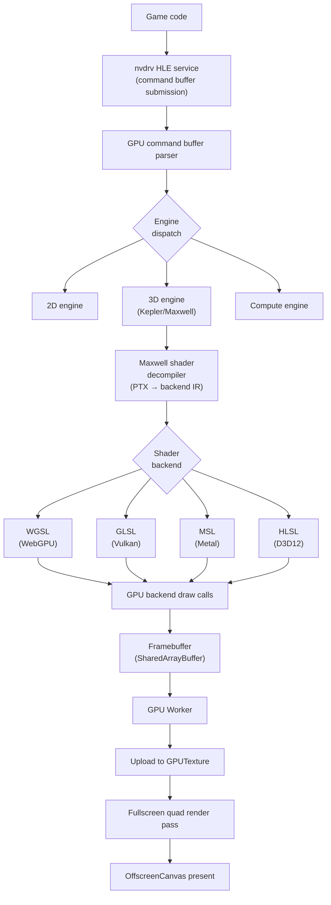

### Shader strategy: hybrid uber-shader + JIT

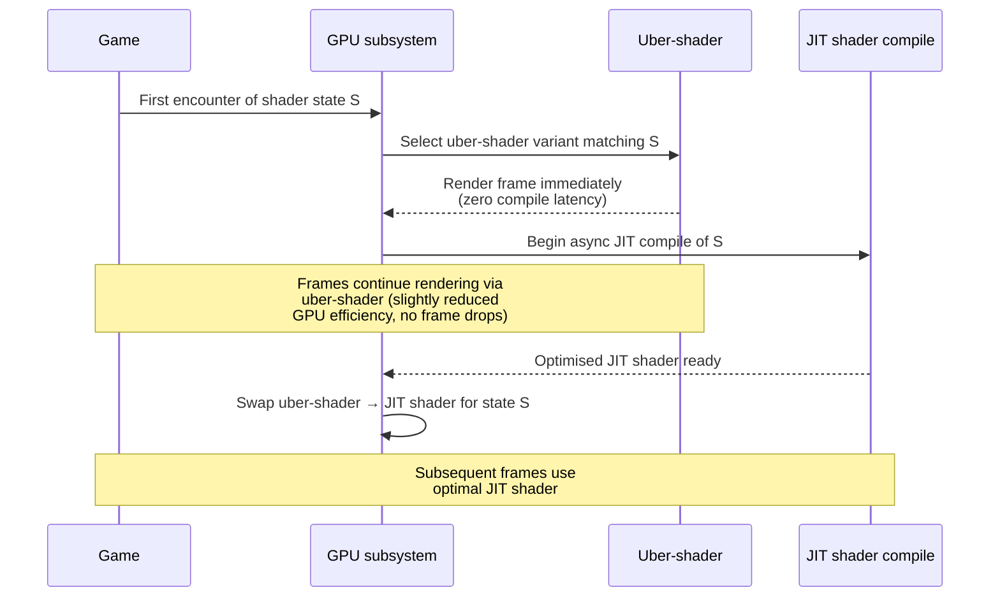

```c
typedef enum GPU_ShaderStrategy {
  GPU_SHADER_STRATEGY_UBER_ONLY,  // development/debug
  GPU_SHADER_STRATEGY_JIT_ONLY,   // will cause stutter on first encounter
  GPU_SHADER_STRATEGY_HYBRID,     // default, uber covers while JIT compiles
} GPU_ShaderStrategy;
```

### ASTC texture transcoding

Maxwell uses ASTC texture compression. Not all target GPUs support ASTC natively.

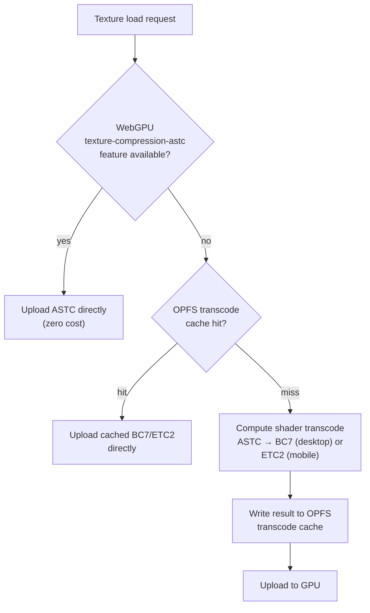

### GPU backend interface

```c
// core/gpu/gpu.h

typedef struct GPU_Backend {
  void* (*create)(void* platform_window_handle);
  void  (*destroy)(void* ctx);

  void  (*submit_frame)(
    void*    ctx,
    uint8_t* framebuffer,       // pointer into SharedArrayBuffer
    uint32_t width,
    uint32_t height
  );

  void* (*compile_shader)(
    void*           ctx,
    const char*     source,
    GPU_ShaderStage stage
  );

  void  (*destroy_shader)(void* ctx, void* shader_handle);

  // Buffer management
  void* (*create_buffer)(void* ctx, size_t size, GPU_BufferUsage usage);
  void  (*destroy_buffer)(void* ctx, void* buffer_handle);
  void  (*upload_buffer)(void* ctx, void* buffer_handle,
                         const void* data, size_t size);

  // Texture management
  void* (*create_texture)(void* ctx, GPU_TextureDescriptor desc);
  void  (*destroy_texture)(void* ctx, void* texture_handle);
  void  (*upload_texture)(void* ctx, void* texture_handle,
                          const void* data, size_t data_size);

  const char* name;     // "webgpu", "vulkan", "metal", "d3d12"
  const char* version;
} GPU_Backend;

extern const GPU_Backend GPU_BACKEND_WEBGPU;
extern const GPU_Backend GPU_BACKEND_VULKAN;
extern const GPU_Backend GPU_BACKEND_METAL;
extern const GPU_Backend GPU_BACKEND_D3D12;
```

### Frame interpolation (optional, Phase 5)

Switch 1 games capped at 30fps can be interpolated to 60fps using motion vectors already computed by the Maxwell 3D engine.

- **Disabled by default** — adds one frame of input latency
- **User opt-in** with explicit warning about latency increase
- **Suppressed on hard cuts** — per-frame metadata detects scene changes
- **HUD elements excluded** — 2D overlay elements do not interpolate correctly
- Implementation: GPU Worker, WebCodecs VideoEncoder/Decoder

---

## 10. Audio Pipeline

### Architecture

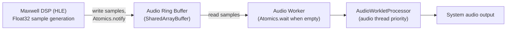

### Ring buffer layout

```
SharedArrayBuffer layout:
  Bytes 0-3:   write index (Int32, written by DSP, read by Audio Worker)
  Bytes 4-7:   read index  (Int32, written by Audio Worker, read by DSP)
  Bytes 8-N:   Float32 sample data (stereo interleaved: L, R, L, R, ...)

Capacity: configurable, default 4096 samples (audio latency ~93ms at 44100Hz)
          reduce for lower latency, increase if underruns occur
```

### Audio backend interface

```c
// core/audio/audio.h

typedef struct Audio_Backend {
  void* (*create)(uint32_t sample_rate, uint32_t channel_count);
  void  (*destroy)(void* ctx);
  void  (*submit_samples)(void* ctx, const float* samples, size_t sample_count);
  void  (*flush)(void* ctx);
  const char* name;
} Audio_Backend;

extern const Audio_Backend AUDIO_BACKEND_WEBAUDIO;
extern const Audio_Backend AUDIO_BACKEND_WASAPI;
extern const Audio_Backend AUDIO_BACKEND_COREAUDIO;
extern const Audio_Backend AUDIO_BACKEND_PIPEWIRE;
```

---

## 11. Storage Architecture

### What goes where

| Data | Storage | Reason |
|---|---|---|
| Game files (decrypted NCA) | `FileSystemDirectoryHandle` | User owns, never copy multi-GB into browser storage |
| prod.keys (if user supplies for save crypto only) | `FileSystemDirectoryHandle` | User owns; Voland never uses for content decryption per §1.6 |
| Save data | OPFS | Emulator managed, fast I/O, explicit quota errors |
| Shader cache | OPFS sync access handle (Worker) | Frequent small reads on render hot path |
| Translation cache (PTC) | OPFS sync access handle (Worker) | Same as shader cache |
| Downloaded mods | OPFS | Fetched/generated, emulator managed |
| Large mod packs | `FileSystemDirectoryHandle` | User owns, read directly, never copy |
| Compatibility DB | Compatibility Shared Worker memory | Shared across tabs, fetched once |
| Settings | IndexedDB | Small structured data, metadata queries |
| Amiibo .bin files | OPFS | Small, emulator managed |
| Transcoded textures | OPFS | Keyed by texture hash, avoids re-transcoding |

### Storage tier overview

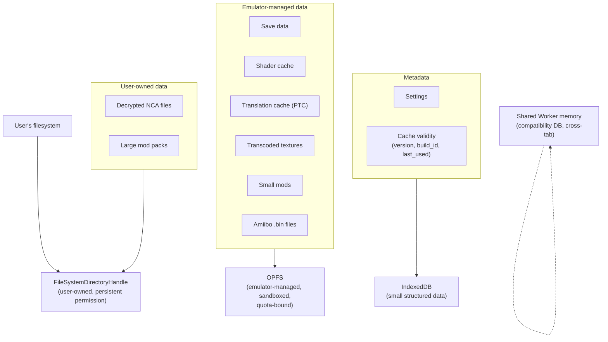

### Filesystem Access API: persistent handles

```typescript
// platform/web/src/store/filesystem.ts

interface StoredHandles {
  readonly gamesDirectory:  FileSystemDirectoryHandle | null;
  readonly keysFile:        FileSystemFileHandle | null;
  readonly firmwareDirectory: FileSystemDirectoryHandle | null;
}

// Store handles in IndexedDB; permission survives page reload.
// User must re-confirm permission once per browser session.
async function persistDirectoryHandle(
  key: string,
  handle: FileSystemDirectoryHandle
): Promise<void> {
  const db = await openHandleDatabase();
  await db.put("handles", handle, key);
}

async function restoreDirectoryHandle(
  key: string
): Promise<FileSystemDirectoryHandle | null> {
  const db = await openHandleDatabase();
  const handle = await db.get("handles", key);
  if (!handle) return null;

  // Re-verify permission, may prompt user
  const permission = await handle.requestPermission({ mode: "read" });
  return permission === "granted" ? handle : null;
}
```

### Cache invalidation via IndexedDB

Shader and translation caches are binary blobs in OPFS. Their validity metadata lives in IndexedDB:

```typescript
// platform/web/src/store/cache-metadata.ts

interface ShaderCacheMetadata {
  readonly titleId:        string;
  readonly cacheVersion:   number;  // bump on breaking IR changes
  readonly backendVersion: string;  // Ballistic semver
  readonly entryCount:     number;
  readonly lastUsedAt:     number;  // Date.now(), for LRU eviction
  readonly byteSize:       number;
}

const CURRENT_CACHE_VERSION = 1; // increment when shader cache format changes

async function validateShaderCache(titleId: string): Promise<boolean> {
  const metadata = await getShaderCacheMetadata(titleId);
  if (!metadata) return false;

  const isValid =
    metadata.cacheVersion   === CURRENT_CACHE_VERSION &&
    metadata.backendVersion === CURRENT_BACKEND_VERSION;

  if (!isValid) {
    await deleteShaderCacheFromOpfs(titleId);
    await deleteShaderCacheMetadata(titleId);
  }

  return isValid;
}
```

### LRU eviction policy

OPFS has a per-origin quota that varies by browser and storage pressure. Voland enforces a soft cap and evicts on quota errors:

- **Soft cap:** 8 GB total OPFS usage across all caches
- **Hard cap:** browser-imposed quota (typically 60% of available disk per origin)
- **Eviction trigger:** OPFS write error with QuotaExceededError, or scheduled check at startup if usage > soft cap
- **Eviction order:** by `lastUsedAt` ascending (oldest unused first), per-title
- **Never evicts:** save data, settings, any user-supplied content

### "Increase performance for others" toggle (per-user, local-only)

Per §1.6, Voland operates no aggregation server. The toggle's behavior:

- **Off (default):** Per-user JIT cache (PTC) writes to OPFS, evicted by LRU per above.
- **On:** Per-user JIT cache writes to OPFS more aggressively (larger cap, less aggressive eviction). User can manually export their cache to a file via Settings; users can manually import a friend's exported cache via Settings.

Voland never uploads cache data to any server. There is no "cloud cache." This is a deliberate scope decision per §1.6.

### OPFS sync access handle pattern

```typescript
// Always use sync access handle inside a Worker for cache reads
// Never use async API on the hot path

async function openCacheForSyncAccess(
  fileName: string
): Promise<FileSystemSyncAccessHandle> {
  const root = await navigator.storage.getDirectory();
  const fileHandle = await root.getFileHandle(fileName, { create: true });
  return await fileHandle.createSyncAccessHandle();
}

// In GPU Worker, synchronous, no async overhead
function readShaderFromCache(
  syncHandle: FileSystemSyncAccessHandle,
  offset: number,
  buffer: Uint8Array
): number {
  return syncHandle.read(buffer, { at: offset });
}
```

---

## 12. Web Platform Layer

### Required HTTP headers

**These headers must be set on every response or the entire Worker architecture fails.**

```
Cross-Origin-Opener-Policy: same-origin-allow-popups
Cross-Origin-Embedder-Policy: require-corp
```

`same-origin-allow-popups` rather than `same-origin` allows OAuth popups to retain opener access.

Set in hosting config AND re-injected by Service Worker on cached responses:

```typescript
// platform/web/sw.ts

function addCrossOriginIsolationHeaders(response: Response): Response {
  const headers = new Headers(response.headers);
  headers.set("Cross-Origin-Opener-Policy", "same-origin-allow-popups");
  headers.set("Cross-Origin-Embedder-Policy", "require-corp");
  return new Response(response.body, {
    status:     response.status,
    statusText: response.statusText,
    headers,
  });
}
```

### Boot sequence

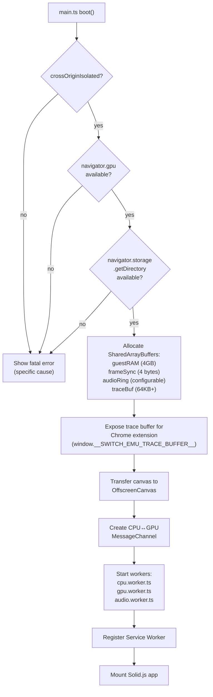

```typescript
// platform/web/src/main.ts

async function boot(): Promise<void> {
  // 1. Verify cross-origin isolation
  if (!crossOriginIsolated) {
    showFatalError(
      "Cross-origin isolation is not active. " +
      "SharedArrayBuffer is unavailable. " +
      "Ensure the server sets COOP and COEP headers."
    );
    return;
  }

  // 2. Verify WebGPU availability
  if (!("gpu" in navigator)) {
    showFatalError(
      "WebGPU is not available in this browser. " +
      "Use Chrome 113+, Edge 113+, or Firefox with WebGPU enabled."
    );
    return;
  }

  // 3. Verify OPFS availability
  const opfsAvailable =
    "storage" in navigator &&
    "getDirectory" in navigator.storage;

  if (!opfsAvailable) {
    showFatalError("Origin Private Filesystem (OPFS) is not available.");
    return;
  }

  // 4. Allocate shared memory
  const guestRAM  = new SharedArrayBuffer(4 * 1024 * 1024 * 1024); // 4GB
  const frameSync = new SharedArrayBuffer(4);                       // Int32
  const audioRing = new SharedArrayBuffer(AUDIO_RING_BYTE_SIZE);
  const traceBuf  = new SharedArrayBuffer(TRACE_BUFFER_BYTE_SIZE);

  // 5. Expose trace buffer for Chrome extension
  (window as any).__SWITCH_EMU_TRACE_BUFFER__   = traceBuf;
  (window as any).__SWITCH_EMU_TRACE_METADATA__ = {
    version:          1,
    eventSizeBytes:   24,
    capacityEvents:   TRACE_BUFFER_CAPACITY,
    writeIndexOffset: 0,
    eventsOffset:     8,
  };

  // 6. Transfer canvas to GPU Worker
  const canvas    = document.getElementById("game") as HTMLCanvasElement;
  const offscreen = canvas.transferControlToOffscreen();

  // 7. Create direct CPU↔GPU communication channel
  const { port1: cpuSyncPort, port2: gpuSyncPort } = new MessageChannel();

  // 8. Start workers
  const cpuWorker   = new Worker("workers/cpu.worker.ts",   { type: "module" });
  const gpuWorker   = new Worker("workers/gpu.worker.ts",   { type: "module" });
  const audioWorker = new Worker("workers/audio.worker.ts", { type: "module" });

  gpuWorker.postMessage(
    { type: "init", canvas: offscreen, guestRAM, frameSync, traceBuf, port: gpuSyncPort },
    [offscreen, gpuSyncPort]
  );

  cpuWorker.postMessage(
    { type: "init", guestRAM, frameSync, audioRing, traceBuf, port: cpuSyncPort },
    [cpuSyncPort]
  );

  audioWorker.postMessage({ type: "init", audioRing });

  // 9. Register Service Worker
  if ("serviceWorker" in navigator) {
    await navigator.serviceWorker.register("/sw.ts", { type: "module" });
  }

  // 10. Mount Solid.js app
  mountApp({ cpuWorker, gpuWorker, audioWorker, guestRAM });
}
```

### Routing

Navigation API intercepts all client-side navigation. Service Worker serves `index.html` for all navigate requests; this enables hard refresh at `/game/:titleId`.

```typescript
// platform/web/src/router.ts

const routes = [
  { pattern: /^\/$/, view: "library" },
  { pattern: /^\/settings\/?$/, view: "settings" },
  { pattern: /^\/settings\/graphics\/?$/, view: "settings-graphics" },
  { pattern: /^\/settings\/controls\/?$/, view: "settings-controls" },
  { pattern: /^\/settings\/audio\/?$/, view: "settings-audio" },
  { pattern: /^\/game\/([0-9A-Fa-f]{16})\/?$/, view: "game", param: "titleId" },
  { pattern: /^\/game\/([0-9A-Fa-f]{16})\/saves\/?$/, view: "saves", param: "titleId" },
  { pattern: /^\/game\/([0-9A-Fa-f]{16})\/mods\/?$/, view: "mods", param: "titleId" },
  { pattern: /^\/compatibility\/?$/, view: "compatibility" },
] as const;

navigation.addEventListener("navigate", (event: NavigateEvent) => {
  const url = new URL(event.destination.url);
  if (url.origin !== location.origin) return;

  event.intercept({
    async handler() {
      if (document.startViewTransition) {
        await document.startViewTransition(() => renderRoute(url.pathname)).finished;
      } else {
        await renderRoute(url.pathname);
      }
    },
  });
});
```

### Worker message protocol

```typescript
// platform/web/bindings/protocol.ts

// Main thread → CPU Worker
type MainToCPUMessage =
  | { type: "init";       guestRAM: SharedArrayBuffer; frameSync: SharedArrayBuffer;
                          audioRing: SharedArrayBuffer; traceBuf: SharedArrayBuffer;
                          port: MessagePort }
  | { type: "load-game";  titleId: string; fileHandle: FileSystemFileHandle }
  | { type: "gamepad";    index: number; buttons: boolean[]; axes: number[] }
  | { type: "pause" }
  | { type: "resume" }
  | { type: "save-state"; slot: number }
  | { type: "load-state"; slot: number };

// CPU Worker → Main thread
type CPUToMainMessage =
  | { type: "fps";         value: number }
  | { type: "game-loaded"; titleId: string; title: string }
  | { type: "error";       message: string }
  | { type: "halted" };

// Main thread → GPU Worker
type MainToGPUMessage =
  | { type: "init";        canvas: OffscreenCanvas; guestRAM: SharedArrayBuffer;
                           frameSync: SharedArrayBuffer; traceBuf: SharedArrayBuffer;
                           port: MessagePort }
  | { type: "resize";      width: number; height: number };

// CPU Worker → Compiler Shared Worker
type CPUToCompilerMessage = {
  readonly requestId:  number;       // for matching responses
  readonly titleId:    string;       // for OPFS cache key namespacing
  readonly address:    number;       // guest ARM address of the block
  readonly armBytes:   Uint8Array;   // ARM instruction bytes to compile
};

// Compiler Shared Worker → CPU Worker
type CompilerToCPUMessage =
  | { readonly requestId: number; readonly address: number; readonly module: WebAssembly.Module }
  | { readonly requestId: number; readonly address: number; readonly error: string };
```

### Progressive enhancement by platform

```typescript
// platform/web/src/capabilities.ts

interface PlatformCapabilities {
  readonly webGPU:              boolean;
  readonly opfs:                boolean;
  readonly sharedArrayBuffer:   boolean;
  readonly filesystemAccessApi: boolean;
  readonly webHID:              boolean;
  readonly webNFC:              boolean;
  readonly webCodecs:           boolean;
  readonly computePressure:     boolean;
  readonly screenWakeLock:      boolean;
  readonly vibration:           boolean;
}

function detectCapabilities(): PlatformCapabilities {
  return {
    webGPU:              "gpu" in navigator,
    opfs:                "storage" in navigator && "getDirectory" in navigator.storage,
    sharedArrayBuffer:   crossOriginIsolated,
    filesystemAccessApi: "showDirectoryPicker" in window,
    webHID:              "hid" in navigator,
    webNFC:              "NDEFReader" in window,
    webCodecs:           "VideoEncoder" in window,
    computePressure:     "PressureObserver" in window,
    screenWakeLock:      "wakeLock" in navigator,
    vibration:           "vibrate" in navigator,
  };
}
```

### Service Worker

```typescript
// platform/web/sw.ts

const SHELL_CACHE_NAME = "shell-v1";
const WASM_CACHE_NAME  = "wasm-v1";

const SHELL_ASSETS = [
  "/",
  "/index.html",
  "/app.js",
  "/styles.css",
  "/manifest.json",
];

self.addEventListener("install", (event: ExtendableEvent) => {
  event.waitUntil(
    caches.open(SHELL_CACHE_NAME).then(cache => cache.addAll(SHELL_ASSETS))
  );
  (self as any).skipWaiting();
});

self.addEventListener("activate", (event: ExtendableEvent) => {
  event.waitUntil(
    caches.keys().then(keys =>
      Promise.all(
        keys
          .filter(key => key !== SHELL_CACHE_NAME && key !== WASM_CACHE_NAME)
          .map(key => caches.delete(key))
      )
    )
  );
  (self as any).clients.claim();
});

self.addEventListener("fetch", (event: FetchEvent) => {
  const url = new URL(event.request.url);

  // Navigate requests, always serve index.html (enables client-side routing)
  if (event.request.mode === "navigate") {
    event.respondWith(
      caches.match("/index.html").then(cached => {
        const response = cached ?? fetch("/index.html");
        return Promise.resolve(response).then(addCrossOriginIsolationHeaders);
      })
    );
    return;
  }

  // WASM binary, cache first, very aggressively
  if (url.pathname.endsWith(".wasm")) {
    event.respondWith(
      caches.match(event.request).then(cached => {
        if (cached) return addCrossOriginIsolationHeaders(cached);
        return fetch(event.request).then(response => {
          caches.open(WASM_CACHE_NAME).then(c => c.put(event.request, response.clone()));
          return addCrossOriginIsolationHeaders(response);
        });
      })
    );
    return;
  }

  // Shell assets, cache first
  if (SHELL_ASSETS.some(asset => url.pathname === asset)) {
    event.respondWith(
      caches.match(event.request).then(cached =>
        cached
          ? addCrossOriginIsolationHeaders(cached)
          : fetch(event.request).then(addCrossOriginIsolationHeaders)
      )
    );
    return;
  }

  // API requests, network only, no cache
  if (url.pathname.startsWith("/api/")) {
    event.respondWith(fetch(event.request));
    return;
  }

  // Everything else, network first, cache fallback
  event.respondWith(
    fetch(event.request)
      .then(addCrossOriginIsolationHeaders)
      .catch(() =>
        caches.match(event.request).then(cached =>
          cached ?? new Response("Offline", { status: 503 })
        )
      )
  );
});
```

---

## 13. Native Platform Layers

All native platforms link the C core directly. No IPC between UI and core — function calls through the CPU/GPU/Audio backend vtables.

### Platform matrix

| Platform | UI | Renderer | Audio | JIT path | Distribution |
|---|---|---|---|---|---|
| Web | Solid.js | WebGPU | Web Audio | WASM bytecode | URL / PWA |
| iOS | SwiftUI | Metal | CoreAudio | Requires `dynamic-codesigning` entitlement | Sideload (AltStore) |
| iPadOS | SwiftUI | Metal | CoreAudio | Same as iOS | Sideload |
| tvOS | SwiftUI + focus engine | Metal | CoreAudio | Same as iOS | Sideload |
| visionOS | SwiftUI + RealityKit | CompositorServices | CoreAudio | Same as iOS | Sideload |
| Android | Jetpack Compose | Vulkan | AAudio | mmap + mprotect | APK sideload |
| Android TV | Jetpack Compose + D-pad | Vulkan | AAudio | Same as Android | APK sideload |
| macOS | SwiftUI | Metal | CoreAudio | mmap + mprotect | Direct download, notarised |
| Windows | Qt | Vulkan / D3D12 | WASAPI | VirtualAlloc | Direct download |
| Linux | Qt | Vulkan | PipeWire | mmap + mprotect | Direct download |
| Xbox | WinUI 2 | D3D12 | XAudio2 | VirtualAllocFromApp | Developer Mode ($20) |

### iOS JIT entitlement

Without `dynamic-codesigning`:
- `WebAssembly.compile()` for dynamic blocks is throttled by WebKit
- Performance is interpreter-level, most Switch titles unplayable

With `dynamic-codesigning` (sideloaded builds only):
- Full WASM JIT performance
- Apple can revoke this path via policy change — see §24 Risk Register

```xml
<!-- ios/Entitlements.plist, sideload build only -->
<key>dynamic-codesigning</key>
<true/>
```

### Xbox UWP Developer Mode

Xbox runs locked-down Windows but Microsoft officially supports Developer Mode for $20 one-time fee. Any Xbox owner can sideload UWP apps. This is the only gaming console with an official legitimate sideload path.

D3D12 on Xbox is the best-optimised GPU backend in the matrix — the console OS is built around it.

---

## 14. Input Handling

### Architecture

Input is collected on the main thread (only place these APIs work) and forwarded to the CPU Worker each frame:

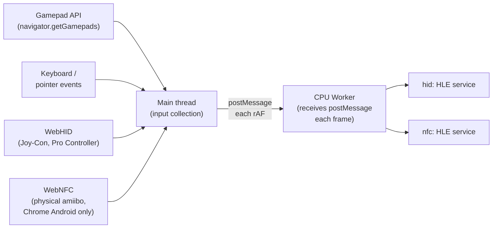

### Gamepad polling

```typescript
// platform/web/src/input.ts

function startInputLoop(cpuWorker: Worker): void {
  function poll(): void {
    const gamepads = navigator.getGamepads();

    for (const gamepad of gamepads) {
      if (!gamepad) continue;
      cpuWorker.postMessage({
        type:    "gamepad",
        index:   gamepad.index,
        buttons: gamepad.buttons.map(b => b.pressed),
        axes:    [...gamepad.axes],
      });
    }

    requestAnimationFrame(poll);
  }

  requestAnimationFrame(poll);
}
```

### Controller button mapping

Switch button layout differs from Xbox layout — A/B and X/Y are swapped:

```typescript
// platform/web/src/input-mapping.ts

interface ControllerProfile {
  readonly name:      string;
  readonly vendorId?: number;
  readonly productId?: number;
  // Maps Switch HID button index to Gamepad API button index
  readonly buttonMap: ReadonlyArray<number>;
}

// Standard gamepad mapping (Xbox-style), most controllers
const STANDARD_MAPPING: ControllerProfile = {
  name:      "Standard",
  buttonMap: [
    1, 0,  // A↔B (swap)
    3, 2,  // X↔Y (swap)
    4, 5,  // L, R
    6, 7,  // ZL, ZR
    8, 9,  // Minus, Plus
    10, 11,// L stick, R stick
    12, 13, 14, 15, // D-pad
    16,    // Home
  ],
};

// Switch Pro Controller via WebHID, direct, no remapping needed
const PRO_CONTROLLER_HID: ControllerProfile = {
  name:      "Switch Pro Controller",
  vendorId:  0x057E,
  productId: 0x2009,
  buttonMap: Array.from({ length: 32 }, (_, i) => i), // 1:1
};
```

### WebHID for Joy-Con (Chrome only, progressive enhancement)

```typescript
// platform/web/src/webhid.ts

const JOY_CON_HID_FILTERS = [
  { vendorId: 0x057E, productId: 0x2006 }, // Joy-Con L
  { vendorId: 0x057E, productId: 0x2007 }, // Joy-Con R
  { vendorId: 0x057E, productId: 0x2009 }, // Pro Controller
] as const;

async function requestJoyConAccess(): Promise<HIDDevice[]> {
  if (!("hid" in navigator)) return []; // not available, skip silently
  return navigator.hid.requestDevice({ filters: [...JOY_CON_HID_FILTERS] });
}

// HD Rumble, forward raw HID rumble data from emulator HID service
async function sendHDRumble(
  device: HIDDevice,
  highFreqAmplitude: number,
  highFreq: number,
  lowFreqAmplitude: number,
  lowFreq: number
): Promise<void> {
  const rumbleData = new Uint8Array([
    highFreqAmplitude,
    highFreq,
    lowFreqAmplitude,
    lowFreq,
  ]);
  await device.sendReport(0x10, rumbleData);
}
```

### Physical amiibo via WebNFC (Chrome Android only)

```typescript
// platform/web/src/nfc.ts

async function scanPhysicalAmiibo(
  onTagRead: (tagData: Uint8Array) => void
): Promise<void> {
  if (!("NDEFReader" in window)) return; // not available, show file picker instead

  const reader = new (window as any).NDEFReader();
  await reader.scan();

  reader.onreading = ({ message }: any) => {
    for (const record of message.records) {
      if (record.recordType === "mime") {
        onTagRead(new Uint8Array(record.data.buffer));
      }
    }
  };
}
```

---

## 15. Mod System

### LayeredFS

```mermaid
flowchart TD
    REQ["Game requests<br/>/romfs/actor/Link.bfres"]

    M_A["Check OPFS:<br/>/mods/{titleId}/mod-a/<br/>romfs/actor/Link.bfres"]
    M_B["Check OPFS:<br/>/mods/{titleId}/mod-b/<br/>romfs/actor/Link.bfres"]
    BASE["Read from base game<br/>RomFS"]

    REQ -->|priority 1| M_A
    M_A -->|miss| M_B
    M_B -->|miss| BASE
    M_A -->|hit| RET["Return file"]
    M_B -->|hit| RET
    BASE --> RET
```

### Mod metadata

```typescript
// platform/web/src/store/mods.ts

interface ModMetadata {
  readonly id:          string;   // UUID
  readonly titleId:     string;
  readonly name:        string;
  readonly version:     string;
  readonly enabled:     boolean;
  readonly priority:    number;   // lower = higher priority
  readonly sizeBytes:   number;
  readonly installedAt: number;   // Date.now()
  readonly source:      "opfs" | "filesystem-handle";
}
```

### Archive extraction (client-side, no server)

| Format | Library | Notes |
|---|---|---|
| `.zip` | fflate (pure JS) | No WASM needed, fast |
| `.7z` | libarchive.wasm | WASM build of libarchive |
| `.rar` | libarchive.wasm | Same build |

Extract to OPFS on install. Large mod packs (>500MB) kept as Filesystem Access API handles and read directly — never copy to OPFS.

---

## 16. Local Multiplayer

### Architecture

WebRTC DataChannel with unreliable transport (UDP semantics) to match the Switch LDN protocol latency profile.

```mermaid
sequenceDiagram
    participant A as Player A (host)
    participant S as Signalling Server
    participant B as Player B (guest)

    A->>S: POST /rooms { titleId }
    S-->>A: { roomCode: "ABC123" }
    B->>S: POST /rooms/ABC123/join
    S->>A: Player B wants to join
    A-->>S: WebRTC offer
    S-->>B: Offer
    B-->>S: WebRTC answer
    S-->>A: Answer
    Note over A,B: ICE exchange via signalling
    A<<->>B: P2P DataChannel established
    Note over S: Signalling out of path
    A<<->>B: LDN packets over DataChannel
```

### LDN packet interception

```c
// core/hle/services/network/ldn.c

// Intercept at LDN service boundary; game never knows it's not on local WiFi
void ldn_on_send_packet(LDN_Context* ctx,
                         const void*  packet_data,
                         size_t       packet_size,
                         uint32_t     destination_node_id) {
  // Serialise and forward to WebRTC DataChannel via JS callback
  ldn_platform_send(ctx->platform_handle,
                    packet_data, packet_size,
                    destination_node_id);
}

void ldn_on_packet_received(LDN_Context* ctx,
                              const void*  packet_data,
                              size_t       packet_size,
                              uint32_t     source_node_id) {
  // Inject into LDN service as if received from local network
  ldn_deliver_packet(ctx, packet_data, packet_size, source_node_id);
}
```

### TURN server fallback

Symmetric NAT (common in universities and offices) causes P2P connection failure. TURN server relays traffic when direct P2P fails:

```typescript
// platform/web/src/multiplayer/webrtc.ts

const ICE_SERVERS: RTCIceServer[] = [
  { urls: "stun:stun.l.google.com:19302" },            // free STUN
  // User-configured TURN, loaded from settings
  // Default: no TURN (P2P only, may fail on symmetric NAT)
];

async function handleIceConnectionFailure(
  connection: RTCPeerConnection,
  signalingPort: MessagePort
): Promise<void> {
  const restartOffer = await connection.createOffer({ iceRestart: true });
  await connection.setLocalDescription(restartOffer);
  signalingPort.postMessage({ type: "ice-restart", offer: restartOffer });
}
```

Users can configure their own TURN server credentials in Settings. Recommended self-hosted TURN: Coturn ([github.com/coturn/coturn](https://github.com/coturn/coturn)).

---

## 17. Amiibo

### OPFS-based virtual amiibo

```typescript
// platform/web/src/amiibo.ts

async function injectAmiiboFromFile(
  cpuWorker: Worker,
  binFile: File
): Promise<void> {
  const buffer = await binFile.arrayBuffer();
  cpuWorker.postMessage({
    type:    "amiibo-inject",
    tagData: new Uint8Array(buffer),
  });
}

// Virtual amiibo from public amiibo API; generates correct .bin format
async function injectVirtualAmiibo(
  cpuWorker: Worker,
  amiiboId: string
): Promise<void> {
  const tagData = await generateAmiiboTagData(amiiboId);
  cpuWorker.postMessage({
    type:    "amiibo-inject",
    tagData,
  });
}
```

### NFC HLE service flow

```mermaid
flowchart TD
    GAME["Game calls NFC service<br/>requesting tag scan"]
    HLE["NFC HLE service"]
    INJ{"Injected tag<br/>data present?"}
    PHYS{"Physical scan<br/>via WebNFC<br/>requested?"}
    RES["Return tag data<br/>to game"]

    GAME --> HLE
    HLE --> INJ
    INJ -->|yes| RES
    INJ -->|no| PHYS
    PHYS -->|"scan succeeds<br/>(Chrome Android)"| RES
    PHYS -->|"unavailable or<br/>cancelled"| EMPTY["Return 'no tag' to game"]
```

---

## 18. Companion App

A lightweight app for phone/watch that communicates with the running emulator via local WebSocket. The emulator exposes a WebSocket server on a local port discoverable via mDNS.

### Features by platform

| Feature | watchOS | iOS/Android phone | iPad |
|---|---|---|---|
| Game status / FPS | ✓ | ✓ | ✓ |
| Remote controller input | ✓ (limited) | ✓ | ✓ |
| Save state management | — | ✓ | ✓ |
| Secondary display (touchscreen) | — | ✓ | ✓ |
| Screenshot gallery | — | ✓ | ✓ |
| Mod management | — | ✓ | ✓ |

### Secondary display

The Switch uses its touchscreen as a secondary display in some games (inventory, maps, item management). The companion app can display this content by receiving the secondary framebuffer region from the emulator over the WebSocket connection — the same region the Switch would render to its touchscreen.

---

## 19. Developer Tooling

### Trace buffer

```c
// core/common/log.h

// 24 bytes per event, fits 2730 events per 64KB page
typedef struct __attribute__((packed)) Trace_Event {
  uint64_t timestamp_ns;   // Atomics-safe monotonic timestamp
  uint32_t event_type;     // TRACE_SVC, TRACE_GPU_CMD, TRACE_AUDIO_UNDERRUN, ...
  uint32_t thread_id;      // which worker emitted this
  uint32_t payload[2];     // event-type-specific data
} Trace_Event;

#define TRACE_BUFFER_CAPACITY 65536 // events
#define TRACE_BUFFER_BYTE_SIZE (8 + TRACE_BUFFER_CAPACITY * sizeof(Trace_Event))
// Bytes 0-3: write index (Int32, atomic)
// Bytes 4-7: padding
// Bytes 8+:  Trace_Event array

// Write a trace event, called from any thread
void trace_emit(uint32_t event_type, uint32_t thread_id,
                uint32_t payload0, uint32_t payload1);
```

### Public trace buffer interface (for Chrome extension)

```typescript
// Exposed on window at boot, stable public interface
window.__SWITCH_EMU_TRACE_BUFFER__ = traceBuf;       // SharedArrayBuffer
window.__SWITCH_EMU_TRACE_METADATA__ = {
  version:          1,
  eventSizeBytes:   24,
  capacityEvents:   65536,
  writeIndexOffset: 0,
  eventsOffset:     8,
};
window.__SWITCH_EMU_BREAKPOINT_BUF__ = breakpointBuf; // SharedArrayBuffer
window.__SWITCH_EMU_HALT_FLAG__      = haltFlag;       // SharedArrayBuffer
```

### Out-of-process profiling

```mermaid
flowchart LR
    subgraph EmuTab["Emulator tab"]
        CPU_W["CPU Worker"]
        GPU_W["GPU Worker"]
        AUD_W["Audio Worker"]
        TB["Trace Buffer<br/>(SharedArrayBuffer)"]
    end

    subgraph ExtCtx["Chrome Extension<br/>(out-of-process)"]
        EXT["Extension content script"]
        UI_T["Timeline UI"]
    end

    CPU_W -->|trace_emit| TB
    GPU_W -->|trace_emit| TB
    AUD_W -->|trace_emit| TB
    EXT -->|reads directly,<br/>zero overhead on emulator| TB
    EXT --> UI_T
```

The Chrome extension reads the trace buffer out-of-process, directly from the SharedArrayBuffer, without any involvement from the emulator's main thread, CPU Worker, GPU Worker, or any emulator code. **Zero overhead on the emulator during profiling.**

### Hot-reload HLE (development builds only)

```cmake
# CMakeLists.txt
if(CMAKE_BUILD_TYPE STREQUAL "Debug" AND EMSCRIPTEN)
  # Main module dynamically loads side modules
  target_link_options(switch_core PRIVATE -s MAIN_MODULE=1)

  # Each HLE service as a reloadable side module
  foreach(SERVICE sm fsp audio hid nvdrv)
    add_library(hle_${SERVICE} SHARED ...)
    target_link_options(hle_${SERVICE} PRIVATE -s SIDE_MODULE=1)
  endforeach()
endif()
```

Allows recompiling a single HLE service and hot-swapping it into the running browser tab without losing game state. Production builds use static linking.

### Sparse VMM for Switch 2 (planned)

Switch 2 is expected to feature 12-16GB RAM. WASM memory64 supports declaring large address spaces without requiring full physical backing.

```c
// core/common/vmm.h

// Declare 16GB address space, commit pages on demand
typedef struct VMM_Context VMM_Context;

VMM_Context* vmm_create(uint64_t address_space_size);
void         vmm_destroy(VMM_Context* ctx);

// Called on page fault, maps in next chunk from OPFS compressed storage
void         vmm_handle_page_fault(VMM_Context* ctx, uint64_t guest_address);
```

---

## 20. Build System

### CMake options

```cmake
# CPU backend, default is noop, always builds
option(CPU_BACKEND "noop|interpreter|dynarmic|ballistic" "noop")

# GPU backend, default is auto-detected by platform
option(GPU_BACKEND "webgpu|vulkan|metal|d3d12|auto" "auto")

# Audio backend, default is auto-detected by platform
option(AUDIO_BACKEND "webaudio|wasapi|coreaudio|pipewire|auto" "auto")

# Build type
option(CMAKE_BUILD_TYPE "Debug|Release|RelWithDebInfo" "Debug")
```

### WASM build flags

```cmake
if(EMSCRIPTEN)
  target_compile_options(switch_core PRIVATE
    -msimd128                # REQUIRED, without this NEON → WASM SIMD fails, ~4x slowdown
  )

  target_link_options(switch_core PRIVATE
    -s WASM=1
    -s WASM_BIGINT=1         # Required for 64-bit integer interop
    -s SHARED_MEMORY=1       # Required for SharedArrayBuffer
    -s USE_PTHREADS=1        # Required for Worker threading model
    -s PTHREAD_POOL_SIZE=8
    -s MAXIMUM_MEMORY=4GB    # Guest RAM size
    -s MEMORY64=1            # Required for >4GB address space (Switch 2)
    -s EXPORTED_FUNCTIONS='["_emulator_create","_emulator_destroy",
                             "_emulator_run","_cpu_get_reg","_cpu_set_reg"]'
    -s EXPORTED_RUNTIME_METHODS='["ccall","cwrap"]'
  )
endif()
```

### Platform build targets

```cmake
# Web (requires Emscripten toolchain)
# cmake -DCMAKE_TOOLCHAIN_FILE=$EMSDK/cmake/Modules/Platform/Emscripten.cmake \
#       -DCPU_BACKEND=ballistic -DGPU_BACKEND=webgpu ..

# Desktop (Linux/Windows/macOS)
# cmake -DCPU_BACKEND=ballistic -DGPU_BACKEND=auto ..

# iOS/macOS/tvOS/visionOS, Xcode project generated
# cmake -G Xcode -DCMAKE_SYSTEM_NAME=iOS ..

# Android, Gradle + CMake integration
# cmake -DANDROID_ABI=arm64-v8a -DANDROID_PLATFORM=android-26 ..

# Xbox UWP, Visual Studio UWP project
# cmake -G "Visual Studio 17 2022" -DCMAKE_SYSTEM_NAME=WindowsStore ..
```

---

## 21. Development Phases

### Overview

```mermaid
flowchart LR
    P0["Phase 0<br/>Skeleton"]
    P1["Phase 1<br/>Load &<br/>Attempt Execution"]
    P2["Phase 2<br/>First<br/>Instructions"]
    P3["Phase 3<br/>First<br/>Pixels"]
    P4["Phase 4<br/>First<br/>Boot"]
    P5["Phase 5<br/>Playable Core +<br/>Compat DB"]
    P6["Phase 6<br/>System<br/>Features"]
    P7["Phase 7<br/>Advanced<br/>Features"]
    P8["Phase 8<br/>Platform<br/>Expansion"]
    P9["Phase 9<br/>Ecosystem &<br/>Polish"]

    P0 --> P1 --> P2 --> P3 --> P4 --> P5 --> P6 --> P7 --> P8 --> P9
```

### Phase 0 — Skeleton

**Goal:** The emulator boots and runs a minimal loop with no real functionality.

- [ ] Repository structure and CMake setup
- [ ] Emulator core wiring (emulator_create, emulator_run)
- [ ] No-op CPU backend (register state only, no execution)
- [ ] SVC hook + stub HLE dispatcher
- [ ] Web scaffolding: CPU worker + SharedArrayBuffer allocation
- [ ] Minimal boot sequence (app loads, workers start, logs visible)

### Phase 1 — Load & Attempt Execution

**Goal:** A real (pre-decrypted) game file loads into memory and execution begins (even if it fails).

- [ ] Decrypted-NCA parsing (RomFS, ExeFS, npdm — no encryption handling per §1.6)
- [ ] Load executable sections into guest memory
- [ ] Memory HLE (SetHeapSize, MapMemory, basic virtual memory)
- [ ] Minimal IPC + sm: service stub
- [ ] Basic input (Gamepad API → CPU worker)
- [ ] Entry point execution attempt
- [ ] User-facing error path for encrypted input pointing to dumping guide

### Phase 2 — First Instructions

**Goal:** Game code executes via interpreter.

- [ ] Interpreter CPU backend (ARM64, partial instruction set)
- [ ] Wire interpreter into emulator loop
- [ ] Threading HLE (CreateThread, StartThread, SleepThread)
- [ ] Basic IPC routing (fake responses acceptable)

### Phase 3 — First Pixels

**Goal:** Render the first visible frame (even if incorrect).

- [ ] Minimal nvdrv stub
- [ ] Basic GPU command buffer parsing (very limited subset)
- [ ] Framebuffer output to SharedArrayBuffer
- [ ] WebGPU renderer (texture upload + fullscreen quad)
- [ ] Hardcoded / fallback rendering path (no full shader system)

### Phase 4 — First Boot

**Goal:** A game reaches its title screen.

- [ ] Expand nvdrv handling (just enough for boot)
- [ ] Minimal shader handling or crude fallback
- [ ] fsp-srv (filesystem, RomFS access on decrypted input)
- [ ] hid service (basic controller input)
- [ ] applet services (lifecycle)
- [ ] time service (basic responses)
- [ ] Audio stub or minimal output

### Phase 5 — Playable Core (+ Compatibility Database)

**Goal:** At least one game runs at playable speed; users can know what works.

- [ ] Integrate JIT backend (Ballistic-x86 on desktop; interpreter on web until Ballistic-WASM ships)
- [ ] Basic shader caching
- [ ] Reduce CPU/GPU sync stalls
- [ ] Expand HLE only as required for stability
- [ ] Fix major crashes and correctness issues
- [ ] **Compatibility database — first cut.** As soon as any game runs, users need a public list of "this game works / this doesn't / this hangs at scene X." Without the DB, every user files a duplicate "does X work?" issue.

### Phase 6 — System Features

**Goal:** Make the emulator usable for real users.

- [ ] Save data (OPFS)
- [ ] Settings (IndexedDB)
- [ ] Basic frontend UI (library, settings)
- [ ] Improved shader pipeline (incremental)
- [ ] Basic texture handling (ASTC fallback if needed)
- [ ] Compatibility DB integration into UI (per-title status visible in library)

### Phase 7 — Advanced Features

**Goal:** Add non-essential functionality.

- [ ] LayeredFS mod system
- [ ] Amiibo support (OPFS + optional WebNFC)
- [ ] Translation cache (PTC) — local-only per §1.6
- [ ] AOT pre-translation as opt-in advanced setting (per-game; user accepts long first-launch in exchange for reduced runtime stutter)
- [ ] Improved audio accuracy

### Phase 8 — Platform Expansion

**Goal:** Port to additional platforms after stabilization.

- [ ] Desktop (Windows / Linux / macOS) Qt/Cocoa wrappers
- [ ] Android Jetpack Compose UI
- [ ] iOS SwiftUI (if `dynamic-codesigning` path remains viable)

### Phase 9 — Ecosystem & Polish

**Goal:** Power-user features and long-term polish.

- [ ] WebRTC multiplayer (LDN)
- [ ] Companion apps (watchOS / iOS / Android)
- [ ] Frame interpolation (optional, default off)
- [ ] Debug tooling (trace buffer UI; Chrome extension)
- [ ] Manual cache export/import for "Increase performance for others" toggle (no aggregation server)

---

## 22. Contributing

### Starting point for new contributors

**If you know TypeScript/JavaScript:** Start with the web platform layer. The CPU backend is a no-op stub; the entire frontend, storage layer, and worker architecture can be built and tested without any emulation knowledge. Begin with the boot sequence in `platform/web/src/main.ts` and work outward.

**If you know C:** Start with the HLE service layer. Pick any unimplemented service from the priority list in section 8. Read the corresponding Ryubing C# implementation as a reference for what the service needs to do. Reimplement it in C following the patterns in this document.

**If you know compiler engineering:** The most valuable contribution is the Ballistic WASM backend. Join the Pound Discord ([discord.gg/aMmTmKsVC7](https://discord.gg/aMmTmKsVC7)) and engage on the IR design. The Ballistic repo's `docs/WASM_BACKEND_DESIGN_DOC.md` describes the current state.

### Code review requirements

- No merge without tests for HLE services
- No C++ in core (dynarmic wrapper excepted; will be removed once Ballistic-x86 covers desktop)
- No `any` in TypeScript
- No third-party dependencies not listed in this document
- All HLE services validated against known-good game output
- **No code that decrypts Nintendo content. No code that operates server-side aggregation of user-derived data.** See §1.6.

### Reference implementations (read, do not fork)

| Project | Language | What to study |
|---|---|---|
| [Ryubing](https://github.com/Ryubing) | C# | HLE service implementations, what each service needs to do |
| yuzu (archived) | C++ | GPU emulation approach, Maxwell command buffer format |
| dynarmic | C++ | ARM instruction semantics, edge cases, test suite |
| Emscripten Relooper | C++ | CFG → structured control flow reference (likely unneeded given Ballistic's scope-based IR) |

Read their code to understand requirements. Reimplement in C targeting this architecture. Do not copy code — licensing and design incompatibilities.

---

## 23. Reference Implementations

### Ballistic (primary recompiler dependency)

- Repository: [github.com/pound-emu/ballistic](https://github.com/pound-emu/ballistic)
- Discord: [discord.gg/aMmTmKsVC7](https://discord.gg/aMmTmKsVC7)
- Language: C
- Status: Working barebones x86 backend in `src/backend/x86/`; WASM backend in design
- Maintainer: [GloriousTacoo](https://github.com/GloriousTacoo)

### Nintendo Switch hardware reference

| Component | Details |
|---|---|
| CPU | ARM Cortex-A57 (4 cores, 1.02GHz docked) |
| GPU | NVIDIA Maxwell (768MHz docked) |
| RAM | 4GB LPDDR4 |
| Storage | eMMC + microSD |
| Wireless | 802.11ac, Bluetooth 4.1 |
| NFC | Type A/B (amiibo) |

### ARM64 instruction reference

- ARM Architecture Reference Manual for A-profile: [developer.arm.com/documentation/ddi0487](https://developer.arm.com/documentation/ddi0487)
- ARM Cortex-A57 Technical Reference Manual: [developer.arm.com/documentation/ddi0488](https://developer.arm.com/documentation/ddi0488)

### WASM specification references

- Binary format: [webassembly.github.io/spec/core/binary](https://webassembly.github.io/spec/core/binary)
- memory64 proposal: [github.com/WebAssembly/memory64](https://github.com/WebAssembly/memory64)
- SIMD proposal: [github.com/WebAssembly/simd](https://github.com/WebAssembly/simd)
- Threads proposal: [github.com/WebAssembly/threads](https://github.com/WebAssembly/threads)

### WebGPU references

- Specification: [gpuweb.github.io/gpuweb](https://gpuweb.github.io/gpuweb)
- WGSL: [gpuweb.github.io/gpuweb/wgsl](https://gpuweb.github.io/gpuweb/wgsl)
- Fundamentals: [webgpufundamentals.org](https://webgpufundamentals.org)

---

## 24. Risk Register

This section names risks that could meaningfully impair or end the project. Some have mitigations; some don't. The point is to be deliberate about what's being signed up for.

| Risk | Severity | Likelihood | Mitigation / Notes |
|---|---|---|---|
| Apple removes `dynamic-codesigning` entitlement for sideloaded apps | High | Low–medium | iOS/iPadOS/tvOS/visionOS lose JIT performance; fall back to interpreter-only on those platforms (likely too slow for AAA titles). Web platform unaffected. Native Apple ports become viewing-only or non-viable on AAA games until/unless Apple reverses. |
| Nintendo legal action against the project | High | Medium | Voland's clean legal posture (no decryption per §1.6, no aggregated cache, no IP redistribution) puts the project on the safer side of the line that killed Yuzu/Citra and is pressuring Suyu. The risk is reduced but not zero — Nintendo can still send takedown requests against any Switch emulator. Maintainer should not host project on personal infrastructure. |
| Suyu-style DMCA action specifically | High | Low (with §1.6 in place) | The Yuzu/Citra/Suyu legal theory (Section 1201 DMCA on circumvention of access controls) does not apply when the project never circumvents. §1.6 is the structural mitigation. Continued discipline is required: contributors will propose decryption-support patches; they must be rejected. |
| Ballistic doesn't reach instruction coverage in time | Medium | Medium | CPU backend abstraction means Voland uses interpreter or dynarmic in the interim. JIT performance suffers but functionality remains. The project ships even if Ballistic stays minimal. |
| WASM JIT compilation latency too high for usable performance | Medium | Medium | Tiered compilation: interpreter immediately, JIT in background. May produce visible stutter on first encounter of code blocks. AOT pre-translation in Phase 7 is the longer-term answer. |
| WebGPU portability issues across browsers | Medium | Medium | Capability detection at boot; fail with clear error if WebGPU unavailable. Native platforms unaffected. Some games may render slightly differently across WebGPU implementations; acceptable until adoption matures. |
| Browser memory limits make 4GB SharedArrayBuffer allocation fail | Medium | Low–medium | Detect at boot; fail with clear error message. No graceful degradation possible — Switch needs the address space. Affected users use native build instead. |
| `Cross-Origin-Embedder-Policy: require-corp` breaks third-party assets | Medium | Medium | Only first-party assets allowed; document the constraint for users self-hosting. Service Worker injects required headers on cached responses. |
| Maintainer burnout | Medium | Medium | Project is a multi-year effort. Variable-cadence contribution is acceptable. Phase plan is realistic, not aggressive. Contributor recruitment is part of Phase 5 onward, not deferred. |
| ASTC texture transcoding compute shader bugs corrupt rendering | Low | Low | OPFS cache key includes transcoder version; cache invalidates on transcoder updates allowing forced rebuild. |
| Service Worker COOP/COEP injection breaks on certain hosting setups | Low | Low | Documented in deployment notes; only affects self-hosting. Voland-hosted PWA always sets headers correctly. |
| Reference-implementation language incompatibilities (Ryubing C# → C reimplementation) | Low | Medium | Reimplementation cost is real but well-understood. Contributors who can't engage with C# don't need to read Ryubing directly; design notes document service behavior. |
| WebRTC LDN packet timing differs from WiFi LDN | Low–medium | High | Some latency-sensitive games (fighting games with frame-perfect inputs) may behave differently in multiplayer. Document as known limitation; not a project-killer. |

The format of this register is "what could go wrong" — not "what will go wrong." Most rows are tolerable risks the project lives with, not show-stoppers. The two High-severity rows (Apple JIT entitlement, Nintendo legal action) are the genuine existential concerns.

---

*Document version: 2.0.0*
*Last updated: May 2026*
*Maintained by: proxy-alt*
